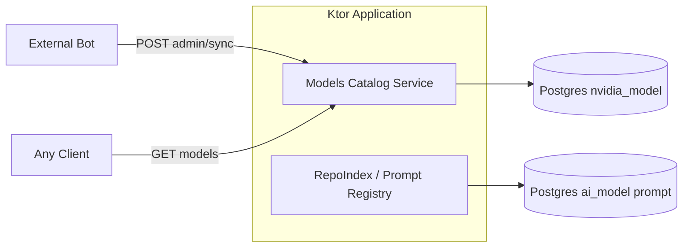

# Models Catalog Service (NVIDIA)

Отдельный backend-сервис в том же Ktor-приложении. **Не является частью Prompt Registry / Repo Index** — свой feature-flag, роуты, DAO и миграции.

## Назначение

- Хранить актуальный каталог моделей **NVIDIA** в Postgres.
- Принимать **snapshot-sync** от внешнего бота (один writer; advisory lock в БД).
- Отдавать публичный **GET** каталога с HTTP-кэшем (ETag / 304).

OpenRouter-модели и prompt registry (`/repoindex/prompts`) этот сервис **не затрагивает**.

## Включение

```env
MODELS_CATALOG_ENABLED=true
```

При `false` роуты `/models-catalog/*` не регистрируются.

## Конфигурация (env)

| Переменная | Обязательна | Описание |
|------------|-------------|----------|
| `MODELS_CATALOG_ENABLED` | да (для работы) | `true` — поднять сервис |
| `MODELS_CATALOG_PG_JDBC_URL` | да* | JDBC URL Postgres |
| `MODELS_CATALOG_PG_USER` | да* | пользователь БД |
| `MODELS_CATALOG_PG_PASSWORD` | да* | пароль |
| `MODELS_CATALOG_ADMIN_TOKEN` | для sync | Bearer для admin-роутов |
| `MODELS_CATALOG_MAX_AGE_SEC` | нет | `Cache-Control: max-age`, default `3600` |
| `MODELS_CATALOG_DEV_FALLBACK_PG` | нет | `true` — разрешить fallback на `PG_*` (только dev) |
| `MODELS_CATALOG_SYNC_RATE_LIMIT_PER_MINUTE` | нет | лимит POST sync на IP (скользящее окно 60 с) |
| `MODELS_CATALOG_SYNC_RATE_LIMIT_TRUST_FORWARDED` | нет | `true` — учитывать X-Forwarded-For (только за доверенным proxy) |

\* Без `MODELS_CATALOG_DEV_FALLBACK_PG=true` переменные `PG_*` **не** подставляются (prod-safe).

## Схема БД

Миграции Flyway: `backend/src/main/resources/db/modelscatalog/` (таблица истории `flyway_modelscatalog_schema_history`).

```sql
create table nvidia_model (
  id bigserial primary key,
  model_id text not null unique,
  display_name text not null,
  is_enabled boolean not null default true,
  created_at timestamptz not null default now(),
  updated_at timestamptz not null default now()
);

create index nvidia_model_enabled_idx on nvidia_model (is_enabled) where is_enabled = true;
```

Таблица `ai_model` из prompt registry **не используется**.

## API

Префикс роутов: `/models-catalog`

### `GET /models-catalog/health`

```json
{ "status": "ok" }
```

### `GET /models-catalog/models`

Публичный каталог enabled NVIDIA-моделей.

Ответ `200`:

```json
{
  "provider": "nvidia",
  "updatedAt": "1970-01-01T00:00:00Z",
  "models": [
    { "modelId": "meta/llama-3.1-70b-instruct", "displayName": "Llama 3.1 70B Instruct" }
  ]
}
```

Кэширование:

- `ETag: "nvidia-<epochMillis>-<enabledCount>-<maxRowId>"` — revision каталога
- `Cache-Control: public, max-age=<MODELS_CATALOG_MAX_AGE_SEC>`
- `If-None-Match` (в т.ч. `*`, weak `W/`, список через запятую) → `304 Not Modified`

### `POST /models-catalog/admin/sync`

Требует `MODELS_CATALOG_ADMIN_TOKEN` + `Authorization: Bearer <token>`.

Тело:

```json
{
  "disableMissing": true,
  "models": [
    { "modelId": "meta/llama-3.1-70b-instruct", "displayName": "Llama 3.1 70B Instruct", "isEnabled": true }
  ]
}
```

Политика sync:

| Правило | Поведение |
|---------|-----------|
| Source of truth | Полный snapshot от бота в каждом запросе |
| Транзакция | upsert + disable в одной TX + `pg_advisory_xact_lock` |
| Upsert | по `model_id`; `updated_at` только при реальном изменении |
| `disableMissing=true` (default) | enabled-модели не из списка → `is_enabled=false` |
| Пустой / blank / duplicate `modelId` | `400` |
| Длина полей | `modelId` ≤ 256, `displayName` ≤ 512 |
| Batch limit | общий `ADMIN_UPSERT_MAX_ITEMS` (1000) |

Ответ:

```json
{
  "status": "ok",
  "upserted": 12,
  "unchanged": 0,
  "disabled": 2,
  "updatedAt": "2026-05-15T12:00:00Z"
}
```

`upserted` — строки вставлены или обновлены; `unchanged` — conflict без изменений.

## Структура кода

```
backend/src/main/kotlin/.../modelscatalog/
  ModelsCatalogFeature.kt
  ModelsCatalogConfig.kt
  ModelsCatalogDb.kt
  NvidiaModelDao.kt
  ModelsCatalogService.kt
  CatalogModelValidation.kt
  ModelsCatalogEtag.kt
  ModelsCatalogRateLimit.kt
  Routes.kt
  Dtos.kt
```

Регистрация в `Application.module()`:

```kotlin
ModelsCatalogFeature.install(this, meterRegistry = prometheusRegistry)
```

Метрики (при `METRICS_PROMETHEUS_ENABLED=true`): `models_catalog.sync`, `models_catalog.sync.applied`, `models_catalog.sync.disabled`.

## Связь с другими сервисами



## Тесты

Пакет `backend/src/test/.../modelscatalog/` (Postgres на `127.0.0.1:54321` или env `MODELS_CATALOG_PG_*_TEST` / `PROMPT_DB_*_TEST`):

| Класс | Что покрывает |
|-------|----------------|
| `CatalogEtagTest` | ETag / If-None-Match |
| `CatalogModelValidationTest` | валидация batch |
| `NvidiaModelDaoTest` | TX sync, upsert, disable |
| `ModelsCatalogServiceTest` | политика sync |
| `ModelsCatalogRoutesTest` | HTTP: auth, 304, лимиты |
| `ModelsCatalogFeatureTest` | feature flag |

```powershell
.\gradlew.bat :backend:test --tests "openqwoutt.textprocessor.backend.modelscatalog.*"
```
